# GHTechCorp Customer Support Chatbot

> An intelligent customer support chatbot powered by OpenAI GPT-4o-mini and Model Context Protocol (MCP) for product inquiries, order management, and customer service automation.

[](https://www.python.org/downloads/)
[](https://gradio.app/)
[](https://langchain.com/)

---

## 📋 Table of Contents

- [Overview](#overview)
- [Screenshots](#screenshots)
- [Architecture](#architecture)
- [Tech Stack](#tech-stack)
- [Features](#features)
- [Getting Started](#getting-started)
- [Project Structure](#project-structure)
- [How It Works](#how-it-works)
- [Reflections](#reflections)
- [Future Enhancements](#future-enhancements)
- [Contributing](#contributing)

---

## 🎯 Overview

This project is a **proof-of-concept customer support chatbot** for GHTechCorp, a fictional computer products company. The chatbot assists customers with:

- **Product Discovery**: Browse, search, and get detailed information about monitors, computers, printers, and accessories
- **Order Management**: Check order status, view order history, and place new orders
- **Customer Verification**: Secure PIN-based authentication for sensitive operations
- **Real-time Support**: Conversational AI interface with context-aware responses

The system demonstrates the integration of **Model Context Protocol (MCP)** with **LangChain** and **OpenAI's GPT-4o-mini** to create a tool-augmented conversational agent with access to external APIs.

## 📸 Screenshots

### Chat Interface

*The main Gradio chat interface where customers interact with the AI support agent*

### Agent in Action

*Example conversation showing the agent using tools to search products and provide recommendations*

---

## 🏗️ Architecture

### High-Level Architecture

```mermaid
graph TB
    User[👤 User] -->|Chat Interface| Gradio[Gradio Web UI]
    Gradio -->|User Message| ChatHandler[Chat Handler]
    ChatHandler -->|Initialize| Agent[LangChain Agent]
    Agent -->|Get Tools| MCP[MCP Client]
    MCP -->|HTTP Request| Server[MCP Server<br/>AWS App Runner]
    Server -->|Tools List| MCP
    MCP -->|Tools| Agent
    Agent -->|Invoke with Tools| LLM[OpenAI GPT-4o-mini]
    LLM -->|Tool Calls| Agent
    Agent -->|Execute Tools| MCP
    MCP -->|API Calls| Server
    Server -->|Data| MCP
    MCP -->|Results| Agent
    Agent -->|Process| LLM
    LLM -->|Response| Agent
    Agent -->|Final Response| ChatHandler
    ChatHandler -->|Display| Gradio
    Gradio -->|Show Message| User
    
    style User fill:#e1f5ff
    style LLM fill:#fff4e1
    style Server fill:#ffe1f5
    style Agent fill:#e1ffe1
```



### Component Interaction Flow


### System Architecture Components


---

## 🛠️ Tech Stack

### Core Technologies

| Component | Technology | Version | Purpose |
|-----------|-----------|---------|---------|
| **Language** | Python | 3.13+ | Core programming language |
| **LLM** | OpenAI GPT-4o-mini | Latest | Natural language understanding and generation |
| **Framework** | LangChain | 1.1.3+ | Agent orchestration and tool integration |
| **MCP Integration** | langchain-mcp-adapters | 0.2.1+ | Model Context Protocol adapter for LangChain |
| **UI Framework** | Gradio | 6.1.0+ | Web-based chat interface |
| **Environment** | python-dotenv | 1.2.1+ | Environment variable management |

### Architecture Patterns

- **Agent-Based Architecture**: Autonomous decision-making with tool selection
- **Model Context Protocol (MCP)**: Standardized protocol for connecting LLMs to external data sources
- **Event-Driven UI**: Async/await pattern for responsive chat interface
- **Prompt Engineering**: System prompt defines agent behavior and capabilities

---

## ✨ Features

### Core Capabilities

✅ **Product Management**
- List products with optional category filtering
- Search products by keyword
- Get detailed product information by SKU

✅ **Order Management**
- View order history by customer ID
- Check order status and details
- Create new orders with verification

✅ **Customer Verification**
- PIN-based authentication system
- Secure customer identity verification
- Protected order creation workflow

✅ **Conversational Interface**
- Natural language understanding
- Context-aware responses
- Error handling with user-friendly messages
- Chat history support

### Tool Integration

The agent has access to the following tools via MCP server. These tools enable the chatbot to interact with the product database, customer records, and order management system.

#### Product Tools

**`demo-list_products`**
- **Description**: Lists products with optional filters by category or active status
- **Use Case**: Browse inventory, check stock, or find available products
- **Parameters**:
  - `category` (optional): Filter by product category (e.g., "Monitors", "Computers", "Printers")
  - `is_active` (optional): Filter by active status (boolean)
- **Returns**: List of products with basic information

**`demo-get_product`**
- **Description**: Retrieves detailed information for a specific product using its SKU
- **Use Case**: Get price, stock, description, and other product details
- **Parameters**:
  - `sku` (required): Product SKU code (e.g., "MON-0054", "COM-0001")
- **Returns**: Complete product details including pricing, inventory, and specifications

**`demo-search_products`**
- **Description**: Searches products by keyword in name or description (case-insensitive, partial match)
- **Use Case**: Discover items by feature or search term
- **Parameters**:
  - `query` (required): Search keyword or phrase
- **Returns**: List of matching products

#### Customer Tools

**`demo-get_customer`**
- **Description**: Fetches customer information using a customer ID (UUID)
- **Use Case**: Look up customer details, shipping address, or role
- **Parameters**:
  - `customer_id` (required): UUID of the customer
- **Returns**: Customer profile with contact information and shipping details

**`demo-verify_customer_pin`**
- **Description**: Verifies a customer's identity using email and a 4-digit PIN
- **Use Case**: Authenticate customer before sensitive operations (required before creating orders)
- **Parameters**:
  - `email` (required): Customer's email address
  - `pin` (required): 4-digit PIN code
- **Returns**: Customer details if authentication succeeds, error otherwise
- **Security Note**: Must be called before `demo-create_order`

#### Order Tools

**`demo-list_orders`**
- **Description**: Lists orders, optionally filtered by customer ID or status
- **Use Case**: View order history or track pending orders
- **Parameters**:
  - `customer_id` (optional): UUID to filter orders by customer
  - `status` (optional): Order status (e.g., "draft", "submitted", "approved", "fulfilled", "cancelled")
- **Returns**: List of orders matching the filters

**`demo-get_order`**
- **Description**: Retrieves full details of a specific order including line items
- **Use Case**: Inspect order contents or analyze purchased products
- **Parameters**:
  - `order_id` (required): UUID of the order
- **Returns**: Complete order details with line items, pricing, and status

**`demo-create_order`**
- **Description**: Creates a new order for a customer with specified items
- **Use Case**: Place new orders after customer verification
- **Parameters**:
  - `customer_id` (required): UUID of the customer
  - `items` (required): Array of order items, each containing:
    - `sku`: Product SKU code
    - `quantity`: Number of items
    - `unit_price`: Price as string (e.g., "299.99")
    - `currency`: Currency code (e.g., "USD")
- **Returns**: Created order with "submitted" status
- **Validation**: Automatically checks inventory availability and customer validity
- **Security Note**: Requires prior customer verification via `demo-verify_customer_pin`

---

## 🚀 Getting Started

### Prerequisites

- Python 3.13 or higher
- OpenAI API key
- Internet connection (for MCP server access)

### Installation

1. **Clone the repository**
   ```bash
   git clone <repository-url>
   cd showcase
   ```

2. **Create a virtual environment**
   ```bash
   python3 -m venv .venv
   source .venv/bin/activate  # On Windows: .venv\Scripts\activate
   ```

3. **Install dependencies**
   
   Using `uv` (recommended):
   ```bash
   uv sync
   ```
   
   Or using `pip`:
   ```bash
   pip install -r requirement.txt
   ```

4. **Configure environment variables**
   ```bash
   cp .env.example .env
   ```
   
   Edit `.env` and add your OpenAI API key:
   ```env
   OPENAI_API_KEY=sk-proj-xxxxx
   ```

### Running the Application

```bash
python app.py
```

The Gradio interface will launch and provide:
- Local URL: `http://127.0.0.1:7860`
- Public URL: Shareable link for external access

---

## 📁 Project Structure

```
showcase/
├── app.py                 # Main application entry point
├── prompt.py              # System prompt and agent instructions
├── logger.py              # Logging configuration
├── pyproject.toml         # Project metadata and dependencies
├── requirement.txt        # Pip requirements file
├── .env.example           # Environment variable template
├── .env                   # Environment variables (gitignored)
├── .gitignore             # Git ignore rules
└── README.md              # This file
```

### Key Files

**`app.py`**
- Initializes MCP client with server configuration
- Creates Gradio chat interface
- Handles async chat function with agent invocation
- Error handling and logging

**`prompt.py`**
- Comprehensive system prompt defining agent behavior
- Tool usage guidelines
- Security protocols for order creation
- Response style and limitations

**`logger.py`**
- Simple logging configuration
- Debug level for development

---

## 🔍 How It Works

### 1. Initialization

When the application starts:
1. Environment variables are loaded from `.env`
2. MCP client connects to the products server at AWS App Runner
3. Gradio web interface is initialized

### 2. Chat Flow

When a user sends a message:

```python
async def chat(message, history):
    # 1. Retrieve available tools from MCP server
    tools = await client.get_tools()
    
    # 2. Create LangChain agent with GPT-4o-mini
    agent = create_agent("gpt-4o-mini", tools, system_prompt=SYSTEM_PROMPT)
    
    # 3. Invoke agent with message and history
    result = await agent.ainvoke({
        "messages": history + [HumanMessage(content=message)]
    })
    
    # 4. Return the agent's response
    yield result["messages"][-1].content
```

### 3. Agent Decision Making

The agent:
1. Analyzes user intent from the message
2. Determines which tools (if any) to use
3. Makes tool calls to the MCP server
4. Processes results and formulates response
5. Returns natural language answer

### 4. MCP Server Integration

The MCP client uses **HTTP transport** to communicate with a remote server:

```python
client = MultiServerMCPClient({
    "products": {
        "transport": "streamable_http",
        "url": "https://vipfapwm3x.us-east-1.awsapprunner.com/mcp"
    }
})
```

---

## 💭 Reflections

### What Went Well ✅

1. **MCP Integration**: The Model Context Protocol integration with LangChain worked seamlessly, providing a clean abstraction for tool usage

2. **Agent Autonomy**: GPT-4o-mini demonstrated strong reasoning capabilities in determining when and how to use tools

3. **Gradio UI**: The chat interface provided by Gradio is simple yet effective, with minimal code required

4. **System Prompt Design**: The detailed system prompt effectively guides agent behavior, including security protocols and response style

5. **Error Handling**: Basic error handling prevents crashes and provides user-friendly error messages

6. **Async Architecture**: The async/await pattern enables responsive UI and efficient I/O operations

### What Could Be Improved ⚠️

1. **Error Handling**: 
   - Generic error messages don't provide specific guidance
   - No retry logic for transient failures
   - MCP server connection errors could be more descriptive

2. **Authentication**:
   - No session management or user persistence
   - PIN verification happens in plain text
   - No rate limiting or brute force protection

3. **Testing**:
   - No unit tests or integration tests
   - No test coverage for tool interactions
   - Manual testing only

4. **Logging**:
   - Minimal logging implementation
   - No structured logging or log aggregation
   - Debug logs not captured in production

5. **Configuration**:
   - MCP server URL is hardcoded
   - No support for multiple environments
   - Limited configurability

6. **User Experience**:
   - No loading indicators during tool execution
   - No conversation export functionality
   - Limited chat history (no persistence)

7. **Observability**:
   - No metrics or monitoring
   - No tracing for debugging agent decisions
   - No analytics on tool usage

8. **Scalability**:
   - Single-threaded async implementation
   - No caching for frequently accessed data
   - MCP client recreates connection per message

---

## 🔮 Future Enhancements

### Short-term Improvements

1. **Enhanced Error Handling**
   ```python
   # Add retry logic with exponential backoff
   # Provide specific error messages
   # Graceful degradation when tools are unavailable
   ```

2. **Session Management**
   - Implement user sessions with cookies/JWT
   - Store conversation history in database
   - Allow conversation export and sharing

3. **Testing Suite**
   - Unit tests for chat handler
   - Integration tests for MCP client
   - Mock testing for OpenAI API calls

4. **Improved Logging**
   ```python
   # Structured JSON logging
   # Request/response tracing
   # Performance metrics
   ```

### Medium-term Features

5. **Multi-tenant Support**
   - Support multiple company configurations
   - Company-specific branding and prompts
   - Isolated data access per tenant

6. **Advanced Analytics**
   - Conversation analytics dashboard
   - Tool usage statistics
   - Customer satisfaction metrics
   - Agent performance monitoring

7. **Enhanced Security**
   - OAuth2 authentication
   - Role-based access control (RBAC)
   - Encrypted data transmission
   - Audit logging

8. **Caching Layer**
   ```python
   # Redis cache for product data
   # LRU cache for frequent queries
   # Reduce MCP server load
   ```

9. **Streaming Responses**
   ```python
   # Token-by-token streaming
   # Real-time tool execution updates
   # Improved perceived performance
   ```

### Long-term Vision

10. **Multi-modal Support**
    - Image upload for product questions
    - Voice input/output
    - PDF document parsing for manuals

11. **Advanced Agent Capabilities**
    - Multi-agent collaboration
    - Memory and personalization
    - Proactive recommendations
    - Sentiment analysis

12. **Integration Ecosystem**
    - CRM integration (Salesforce, HubSpot)
    - Ticketing system integration (Zendesk, Jira)
    - Email and SMS notifications
    - Payment processing integration

13. **Human Handoff**
    - Escalation to human agents
    - Seamless context transfer
    - Collaborative chat mode

14. **Deployment Options**
    - Docker containerization
    - Kubernetes orchestration
    - CI/CD pipeline
    - Multi-region deployment

15. **Alternative LLM Support**
    - Support for Anthropic Claude
    - Support for local models (Llama, Mistral)
    - Model selection based on task
    - Cost optimization strategies

---

## 🤝 Contributing

Contributions are welcome! Here's how you can help:

1. Fork the repository
2. Create a feature branch (`git checkout -b feature/amazing-feature`)
3. Commit your changes (`git commit -m 'Add amazing feature'`)
4. Push to the branch (`git push origin feature/amazing-feature`)
5. Open a Pull Request

### Development Setup

```bash
# Install development dependencies
pip install -e ".[dev]"

# Run linting
ruff check .

# Run formatting
black .

# Run tests
pytest
```

---

## 📝 License

This project is for demonstration purposes. Modify and use as needed for your own projects.

---

## 🙏 Acknowledgments

- **Model Context Protocol (MCP)**: For providing a standardized way to connect LLMs to external tools
- **LangChain**: For the excellent agent orchestration framework
- **Gradio**: For the simple and powerful UI framework
- **OpenAI**: For GPT-4o-mini's impressive reasoning capabilities

---

## 📧 Contact

For questions or feedback, please open an issue in the repository.

---

**Built with ❤️ using Python, LangChain, and OpenAI**
# showcase
